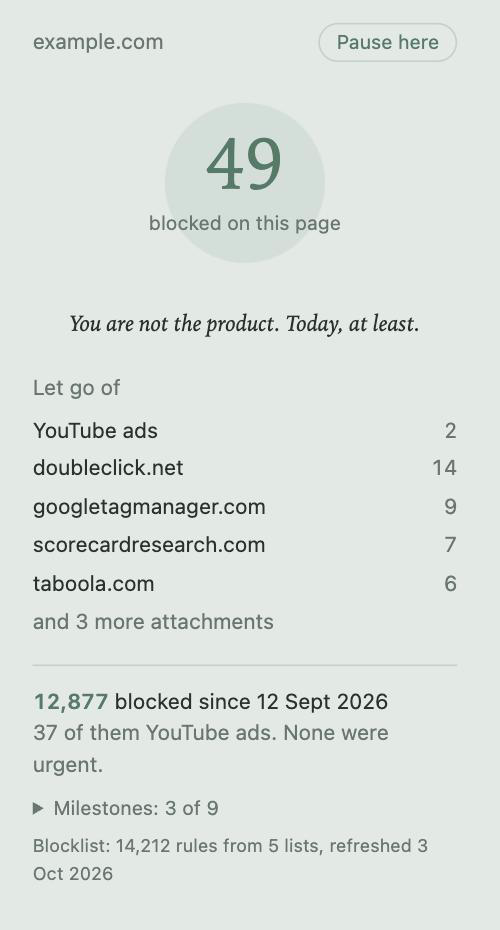

# Quiet

*An ad blocker for Brave and Chrome. A guided meditation that has read the privacy policy.*



Settle into a comfortable position. Close your eyes. Not literally, you're reading.

Notice the web around you. The banners. The pixels. The 38 companies who would like to know how long you hovered over a pair of shoes. Observe them without judgement.

Then block them.

Quiet is a small Manifest V3 extension that removes ads and trackers, counts what it has let go of, and offers a dry remark about it. It will not lecture you, notify you or ask for a rating. It has one animation, a circle that breathes six times a minute, and it is very proud of it.

<br clear="right">

## Why I made this

I had never written a browser extension. I wanted to find out whether the claim is true: that with AI, anyone can now build their own tools instead of renting someone else's. That software is about to become personal and decentralised - a million small, odd, perfectly fitted things instead of a handful of large, general ones that also happen to want your data.

So this is the experiment. Quiet was built almost entirely in conversation with an AI (Claude), by someone who had never built a browser extension before. It blocks real ads, mostly survives YouTube, and it is exactly as sarcastic as I wanted it to be. Nobody else's product roadmap was consulted.

If it works for you too, lovely. If you'd rather have your own, that's rather the point - fork it, or better, make yours from scratch and tell me how it went.

## The practice

**Letting go of the network.** On install and once a week, Quiet downloads EasyList, EasyPrivacy, uBlock Origin's Privacy and Badware lists, and StevenBlack's hosts file, and turns them into around 14,000 native browser blocking rules. Requests to ad and tracking servers simply never happen. If the download fails, the old rules stay and it tries again in an hour. A bundled hosts-only list covers the very first minutes.

**Not seeing what remains.** Common ad containers are hidden with a small, conservative stylesheet. Conservative because hiding `.ad` everywhere breaks half the internet, and enlightenment should not cost you your bank's login page.

**YouTube.** Ad data is quietly removed from the video player's responses before YouTube sees it. If an ad still slips through, it is muted, fast-forwarded and skipped. If YouTube notices and complains, the complaint is removed too. This is an ongoing negotiation; YouTube is not a calm being.

**Pausing.** Some sites only work if you let them watch. "Pause here" turns everything off for that site and reloads it. Acceptance is also a practice.

**Counting.** The popup shows what was blocked on this page, what you've let go of since install, and which domains tried hardest. Everything stays on your device.

**Milestones.** Dry anti-achievements, unlocked quietly. A small dot appears on the icon; the popup tells you once. There are no notifications, because an ad blocker asking for notification permission is the start of a different kind of story.

> *1,000 blocked. You have achieved nothing. Correctly.*

## Installing

Quiet isn't on the Chrome Web Store. You load it yourself, which takes about two minutes and one terminal command.

You'll need [Node.js](https://nodejs.org) 18 or newer (only to build the fallback list - the extension itself has no dependencies).

```bash
git clone https://github.com/hrmau/quiet-ad-blocker.git
```

```bash
cd quiet-ad-blocker && npm run build-rules
```

Then:

1. Open `brave://extensions` (or `chrome://extensions`).
2. Switch on **Developer mode**, top right.
3. Click **Load unpacked** and choose the `quiet-ad-blocker` folder.
4. Pin the closed eye to your toolbar. Breathe.

Within a minute of installing, it downloads the full lists by itself.

## Staying up to date

There are two kinds of update, and only one of them needs you.

- **Blocklists update themselves.** Weekly, with no action from you. This is most of what keeps an ad blocker useful.
- **The extension's own code doesn't.** Unpacked extensions never update automatically. When something changes here, pull it and reload:

```bash
git pull
```

Then press the reload arrow on Quiet's card in `brave://extensions`. Your counts and milestones survive, as long as the folder stays where it is - the browser identifies unpacked extensions by their path, so moving the folder makes it a new extension with a blank slate. Some would call that a fresh start.

Watch or star the repo if you'd like to know when there's something to pull.

## What it doesn't do

- **Cosmetic filters from the big lists.** uBlock Origin hides thousands of site-specific elements; Quiet hides a handful of generic ones. Some empty boxes will remain where ads used to be. Sit with them.
- **Every network rule.** Browser-native blocking can't express everything uBlock Origin can (regex rules, redirects, scriptlets, parameter stripping). Those are skipped. Quiet blocks most things, not all things.
- **Counting outside developer mode.** The per-site counts rely on an API that browsers only allow for unpacked extensions. A Web Store version would need to count differently.
- **Promises about YouTube.** It works until it doesn't. Then it gets fixed. Then it doesn't.

If you need the full strength version, use [uBlock Origin](https://github.com/gorhill/uBlock) or uBlock Origin Lite. They're excellent. They're just not this sarcastic.

## Privacy

Quiet keeps its counts in your browser's local storage and sends them nowhere. The only network requests it makes are to download the filter lists from GitHub. There's an optional sync feature for people who run their own server; it's off, and stays off unless you edit `config.js` yourself. Even then, per-site counts are excluded by default, because they're effectively your browsing history.

## For the curious

| File | What it does |
| --- | --- |
| `background.js` | Counting, the badge, pausing, list refresh, milestones |
| `lists.js` | Downloads filter lists and converts them into browser rules |
| `achievements.js` | The milestones and their remarks |
| `popup/` | The popup |
| `content/` | Cosmetic CSS and the YouTube scripts |
| `allowlist.txt` | Domains never to block, one per line |
| `config.js` | Optional server sync, off by default |

Something broken? Click **service worker** on the extension card for the background console, or open an issue. Describe it calmly.

## Credits

The filter lists do the real work. They are downloaded at runtime, not redistributed; the bundled fallback is StevenBlack only.

- [EasyList and EasyPrivacy](https://easylist.to) (GPLv3 / CC BY-SA 3.0)
- [uBlock Origin filter lists](https://github.com/uBlockOrigin/uAssets) (GPLv3)
- [StevenBlack/hosts](https://github.com/StevenBlack/hosts) (MIT)
- The YouTube approach was informed by [uBlock Origin](https://github.com/gorhill/uBlock)'s public filter lists. No code copied.

## Licence

MIT. Take it, change it, make it yours. That was the whole idea.
